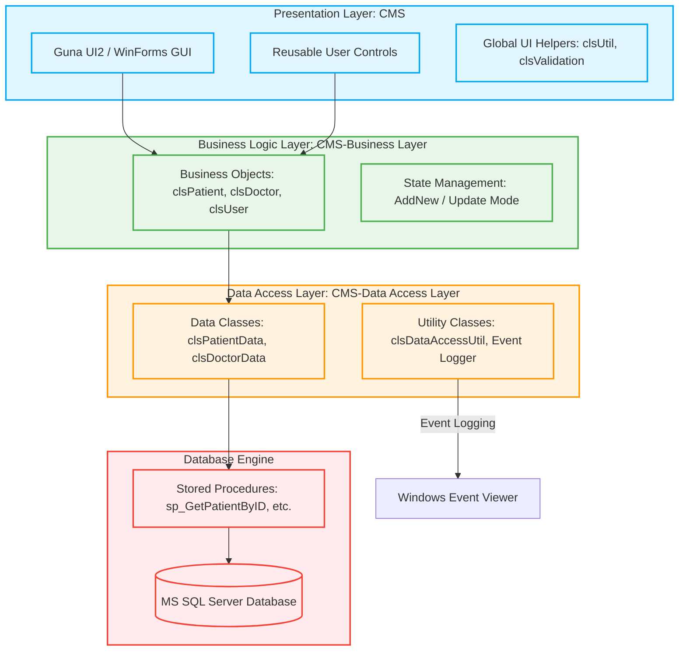

# 🏨 Clinic Management System (CMS)

[](https://dotnet.microsoft.com/)
[](https://learn.microsoft.com/en-us/dotnet/csharp/)
[](https://www.microsoft.com/en-us/sql-server/)
[](https://gunadan.com/)
[](#architecture-and-design-patterns)

A comprehensive, enterprise-grade desktop management application designed to streamline workflows for clinical staff, doctors, and administrators. Built on a robust **3-Tier Architecture** using **C# .NET**, this system integrates advanced controls from **Guna UI2** and **Material Design** to provide a fluid, modern, and high-performance user experience.

---

## 📌 Table of Contents
- [🔍 Architectural Design](#architecture-and-design-patterns)
- [✨ Key Features](#-key-features)
- [🛠️ Tech Stack & Dependencies](#%EF%B8%8F-tech-stack--dependencies)
- [📂 Project Directory Structure](#-project-directory-structure)
- [🔒 Security & Utilities](#-security--utilities)
- [🚀 Setup & Installation Guide](#-setup--installation-guide)
- [🛠️ Database Configuration](#%EF%B8%8F-database-configuration)

---

## 🔍 Architecture and Design Patterns

The project enforces a strict separation of concerns, separating user interfaces, business validation, and data operations into three isolated layers:



### 1. Presentation Layer (`CMS`)
*   **Role**: Handles user interactions and interface rendering.
*   **Key components**: Windows Forms styled with `Guna.UI2` (offering smooth round borders, animations, custom buttons, and cards) and user controls (`ucDashbord`, `ucPersonCard`, `ucMedicalRecordCard`).
*   **Validation**: Uses `clsValidation` for format enforcement (emails, phone numbers, numeric limits) and user feedback.

### 2. Business Logic Layer (`CMS-Business Layer`)
*   **Role**: Coordinates business rules, entity associations, and updates.
*   **Key components**: Strongly typed objects (`clsPerson`, `clsPatient`, `clsDoctor`, `clsAppointment`, etc.) reflecting real-world structures.
*   **Modes**: State tracking through `AddNew` or `Update` modes that determine whether database changes invoke updates or inserts.

### 3. Data Access Layer (`CMS-Data Access Layer`)
*   **Role**: Performs SQL transactions safely and isolates querying from the rest of the application.
*   **Key components**: Standard **ADO.NET** (`SqlConnection`, `SqlCommand`, `SqlDataReader`). It reads the server configuration from `App.config` via `System.Configuration`.
*   **Security**: Uses SQL Stored Procedures to prevent SQL Injection and optimize execution plans.

---

## ✨ Key Features

### 👤 Role-Based Authentication & User Profiles
*   **Role-Based Layouts**: The dashboard adjusts elements automatically depending on the logged-in user's role (Admin, Doctor, or receptionist/staff).
*   **User Profiles**: Password changes (with verifying matching older passwords) and profile picture configurations (supporting default gender pictures if no custom image is uploaded).

### 📊 Real-Time Analytics Dashboard
*   Provides dynamic summary statistics of the system (total doctors, patients count, appointments count, active prescriptions, and billing summaries) using custom User Controls (`ucDashbord`).

### 🩺 Doctor & Specialization Management
*   Profiles doctors, linking them to system users, identifying their fields of specialization, configuring base pricing/fees, and calculating patient load metrics.

### 👥 Patient & Person Directory
*   Tracks patients' complete biographies. Includes blood type registration, nationality lookups, custom profile image storage, address management, and search features using a modular card framework (`ucPersonCardWithSearch`).

### 📅 Appointment Scheduler
*   Manages clinic appointment statuses (Pending, Completed, Cancelled, etc.). It links appointments to specific patients, doctors, medical records, and payments.

### 📋 Medical Records & Consultations
*   Allows doctors to document patient consultations, log diagnoses, and attach clinical notes (`frmConsultation`), archiving them in a history timeline.

### 💊 Prescription System
*   Enables doctors to write prescriptions (detailing drug names, dosages, frequencies, and instructions) directly connected to a consultation/medical record.

### 💳 Invoicing, Payments & Transactions
*   Processes fees and registers transactions (`frmAddShowPayment`, `frmAddEditPaymentTransaction`). Keeps historical records of payment types, dates, and amounts for clinics to audit earnings.

---

## 🛠️ Tech Stack & Dependencies

*   **Language**: C# 7.3+ (.NET Framework 4.7.2)
*   **Target Framework**: Windows Forms (WinForms)
*   **UI Components**:
    *   **Guna.UI2.WinForms** (v2.0.0.1+): Used for modern styling, custom cards, hover animations, and circular profile pictures.
    *   **Material Design Themes** (v5.2.1): Applied for color configurations and interactive elements.
    *   **Microsoft.Xaml.Behaviors.Wpf** (v1.1.39): Supporting UI triggers.
*   **Database System**: MS SQL Server (Express, Standard, or Developer edition)
*   **Data Provider**: ADO.NET (`System.Data.SqlClient`)

---

## 📂 Project Directory Structure

```text
📁 Clinic-Management-System
├── 📁 CMS/                          # Presentation Layer (WinForms Project)
│   ├── 📁 Appointments/             # Appointment forms & controls
│   ├── 📁 Dashboard/                # Analytics/Home dashboard user controls
│   ├── 📁 Doctors/                  # Doctor management forms & search controls
│   ├── 📁 GlobalClasses/            # Utilities (clsUtil, clsValidation, clsLogger)
│   ├── 📁 Login/                    # Authentication screens
│   ├── 📁 MedicalRecords/           # Consultations & clinical file viewer
│   ├── 📁 Patients/                 # Patient files, cards, & records
│   ├── 📁 Payments/                 # Payment records & interfaces
│   ├── 📁 Persons/                  # Shared base demographics UI 
│   ├── 📁 Prescription/             # Prescription creation and viewer
│   ├── 📁 Transaction/              # Financial transactions viewer
│   ├── 📁 Users/                    # System user management
│   ├── 📄 App.config                # Database Connection string setup
│   ├── 📄 CMS.csproj                # Visual Studio Project configuration
│   └── 📄 Program.cs                # Entry point
│
├── 📁 CMS-Business Layer/           # Business Logic Layer (Class Library)
│   ├── 📁 GlobalClasses/            # Password Hashing and Utility helper logic
│   ├── 📄 clsAppointment.cs         # Business Object for Appointments
│   ├── 📄 clsDoctor.cs              # Business Object for Doctors
│   ├── 📄 clsPatient.cs             # Business Object for Patients
│   ├── 📄 clsMedicalRecord.cs       # Business Object for Clinical Records
│   ├── 📄 clsPrescription.cs        # Business Object for Prescriptions
│   ├── 📄 clsPayment.cs             # Business Object for Bills
│   ├── 📄 clsUser.cs                # Business Object for Logged-In Users
│   └── 📄 CMS-Business Layer.csproj # Business Layer Visual Studio Project
│
├── 📁 CMS-Data Access Layer/        # Data Access Layer (Class Library)
│   ├── 📁 GlobalClasses/            # Data Access specific exceptions & hash helper
│   ├── 📄 clsDataAccessUtil.cs      # Core DB connectivity helper & Error Logger
│   ├── 📄 clsAppointmentData.cs     # Data interface for Appointments
│   ├── 📄 clsDoctorData.cs          # Data interface for Doctors
│   ├── 📄 clsPatientData.cs         # Data interface for Patients
│   ├── 📄 clsMedicalRecordData.cs   # Data interface for Medical Records
│   ├── 📄 clsPrescriptionData.cs    # Data interface for Prescriptions
│   ├── 📄 clsPaymentData.cs         # Data interface for Bills
│   └── 📄 CMS-Data Access Layer.csproj
│
└── 📄 CMS.sln                       # Visual Studio Solution File
```

---

## 🔒 Security & Utilities

### 🛡️ PBKDF2 Password Hashing
The application avoids plain-text storage of credentials. `clsPasswordHasher.cs` implements salted, iterative key derivation:
*   **Algorithm**: PBKDF2 (SHA-256)
*   **Salt size**: 16 bytes (128-bit) cryptographically random salt
*   **Key size**: 32 bytes (256-bit)
*   **Work factor**: 100,000 iterations
*   **Formatting**: Output is represented in `$"{Base64(salt)}.{Base64(key)}"` format.
*   **Defense**: Mitigates timing-attack vectors by performing strict byte-by-byte comparison matches during password validation.

### 📝 System Log Integration
Errors, SQL exceptions, and critical failures are handled in the Data Access Layer. `clsDataAccessUtil.LogError` routes exception stacks directly to the **Windows Event Viewer** under the source application name `CMS`. This facilitates easy remote troubleshooting and keeps SQL server error messages out of the user interface.

---

## 🚀 Setup & Installation Guide

### Prerequisites
1.  **Visual Studio** (2019 or later recommended) with the `.NET Desktop Development` workload installed.
2.  **Microsoft SQL Server** (2016 or newer).
3.  **Windows OS** (required to run .NET Framework WinForms & Windows Event Viewer).

---

## 🛠️ Database Configuration

### 1. Database Creation
Create a SQL Server database named `CMS` and configure your stored procedures. The system depends on the following stored procedures (which must exist in your database instance):
*   `sp_GetPatientByID` / `sp_GetPatientByNationalNo` / `sp_GetAllPatients`
*   `sp_AddNewPatientWithPerson` / `sp_UpdatePatientWithPerson` / `sp_DeletePatient`
*   *(Similar procedures exist for Doctors, Persons, Appointments, Payments, and Prescriptions)*

### 2. Configure the Connection String
Open the [App.config](file:///C:/Users/kheli/Desktop/Clinic-Management-System/CMS/App.config) file located in the `CMS` directory and replace the database server details with your configuration:

```xml
<connectionStrings>
    <add name="MyDatabaseConnection"
         connectionString="Server=YOUR_SERVER_NAME;Database=CMS;User Id=YOUR_USER;Password=YOUR_PASSWORD;"
         providerName="System.Data.SqlClient" />
</connectionStrings>
```

> [!TIP]
> If you are using Windows Authentication, use: `connectionString="Server=YOUR_SERVER_NAME;Database=CMS;Integrated Security=True;"`

### 3. Add Project References
Ensure that the `System.Configuration` reference is enabled in both the **CMS-Business Layer** and **CMS-Data Access Layer** projects to allow them to fetch configuration keys from the UI application's `App.config`.

---

## 🏗️ Building and Launching
1.  Double-click [CMS.sln](file:///C:/Users/kheli/Desktop/Clinic-Management-System/CMS/CMS.sln) to load the solution in Visual Studio.
2.  Restore the project's NuGet packages (Material Design Themes & Colors).
3.  Ensure `Guna.UI2.dll` is present in the `bin/Debug` folders or add it as an reference dynamically.
4.  Set **CMS** as the startup project.
5.  Press `F5` or click **Start** to run the compiler and launch the application.

---
*Created by pair programming with Antigravity AI.*